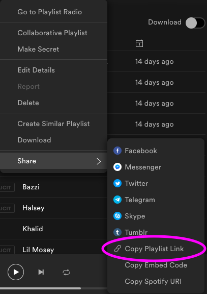

[](https://opensource.org/licenses/mit-license.php) &nbsp;&nbsp;&nbsp; &nbsp;&nbsp;&nbsp;[](https://badge.fury.io/py/spotipy-playlist)&nbsp;&nbsp;&nbsp;          &nbsp;&nbsp;&nbsp; [](https://github.com/prisubs/spotipy-playlist)


# SpotiPyPlaylist
A Spotify-based lyrics analytics client for Python, written with the help of [lyricsgenius](https://pypi.org/project/lyricsgenius/0.3/).
<br>
<br>

## What's New in Version 2
* Caching lyrics on the client object to avoid re-downloading them
* Domain-specific stop word list, including slang and musical terms
* Top frequent keywords using tailored stop list

## Getting Started 
This package requires you to have your own Genius API key on initialization. You can get one on the Genius page [here](https://genius.com/signup_or_login). Once you've done that, SpotiPyPlaylist is available on [PyPi](https://pypi.org) as a pip installable package.

``` bash
pip install spotipy-playlist
```
<br>

Then, you'll need to initialize a client to call the package's functions.
``` python
from spotipy_playlist import SpotiPyPlaylistClient
client = SpotiPyPlaylistClient(YOUR_GENIUS_API_KEY)
```
<br>

## Data Pulling
SpotiPyPlaylist supports gathering playlist lyrics data, given web URLs. To find web URLs, select "Copy Playlist Link" from the share menu on the Spotify web or mobile apps, or "Copy Profile Link" from a user profile.



<br>

Gets a Pandas dataframe of titles, artists, and lyrics given a playlist URL.
``` python
>>> client.playlist_lyrics("https://open.spotify.com/playlist/13So88tnFPcYia9aeXRAQ3?si=VpFOd40KTlaxz6SuN_QM6g")

                          title                             artist                         lyrics
0                       Señorita       Shawn Mendes, Camila Cabello  [Chorus: Camila Cabello] I love it when you c...
1                     Fine China                 Future, Juice WRLD  [Intro: Future & Juice WRLD] The world on dru...
2               Nagada Sang Dhol          Shreya Ghoshal, Osman Mir  [Chorus 1] हे धिन तड़ाक धिन तड़ाक आजा उड़ के...
3   FAKE LOVE (Rocking Vibe Mix)                                BTS  [방탄소년단의 Fake Love (Rocking Vibe Mix) 가사][I...
4                       Feelings                           Maroon 5  [Intro]Woo, woo! Oh, yeah [Verse 1] You...
5    Old Town Road - Diplo Remix  Lil Nas X, Billy Ray Cyrus, Diplo  [Intro: Billy Ray Cyrus]Oh, oh-oh Oh [Re...
6                            Why                              Bazzi  [Verse 1]I'm still on your Netflix Girl, I ...
7                     Without Me                             Halsey  [Verse 1]Found you when your heart was broke...
8                        Vertigo                             Khalid  [Verse 1]Are we better off believing What t...
9                        Noticed                          Lil Mosey  [Intro] Ughh Yeah, yeah Ayy Royce, you did ... 
10                        Panini                          Lil Nas X  [Intro: Nessly] Daytrip took it to 10 (Hey) ...
```

<br>

Gets name and playlist list of a user, given a public profile URL.
``` python
>>> client.user_playlists("https://open.spotify.com/user/31obw73wcndofulfje4bekzfyccy?si=6Bvjvn8YTmKVj_nAQ0mJ6g")

{
  'name': 'Prianka Subrahmanyam',
  'playlists': 
      ['sentient machines', 'meme tunes', 'banana leaf', 'oye hoye', 'jaana hudugi',
      'nice soft feeling', 'sadboi hours', 'serotonin rush', 'edgy', 'hooligan booligan backyardigan',
      'circa 1600', 'k-pop x vocaloid']
}
```

<br>

Once a playlist url pull has happened on a `SpotiPyPlaylistClient` object, that dataframe will be cached to use for all further lyrics analysis functions. You can also upload your own playlist, which needs to be formatted as a Python list-like object or a pandas `Series` of strings.

<br> 

``` python
>>> client.custom_lyrics(
	  [
		  "[Chorus: Camila Cabello] I love it when you",
		  "[Intro: Billy Ray Cyrus]Oh, oh-oh Oh [Re",
		  "[Verse 1]Are we better off believing What t..."
	  ]
)

Successfully cached 3 songs.
```
